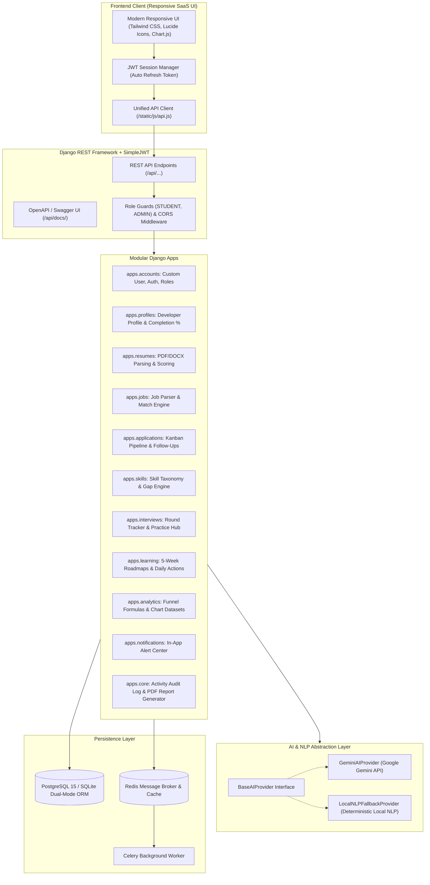

# 🚀 InternTrack AI — Intelligent Career & Internship Management SaaS

> *"Turn internship applications into actionable career intelligence."*

[](https://python.org)
[](https://djangoproject.com)
[](https://www.django-rest-framework.org)
[](https://www.postgresql.org)
[](https://tailwindcss.com)
[](https://aistudio.google.com/)
[](https://docker.com)

---

## 🌟 Overview & Product Vision

**InternTrack AI** is a production-grade full-stack SaaS platform architected for students, fresh graduates, and career changers. Rather than acting as a static spreadsheet or basic CRUD tracker, InternTrack AI transforms every tracked internship application into **actionable career intelligence**:

1. **Where you are applying**: Track application pipelines with stage histories from Saved to Offer.
2. **What companies are asking for**: Extract skills, seniority, and criteria from pasted job postings.
3. **What skills you are missing**: Identify **Critical** (≥50% frequency), **Important** (20-49%), and **Optional** skill gaps.
4. **How your resume aligns**: Calculate an explainable **InternTrack Resume Match Score** (Skills, Projects, Keywords, Education, Experience) with improvement tips.
5. **How your funnel converts**: Dynamic charts measuring real Response Rates, Interview Conversion, and Time-to-Reply from database records.
6. **What to prepare before interviews**: Tailored preparation checklists, topic guides, and interactive question practice.
7. **Personalized 5-Week Roadmap**: Step-by-step technical milestones bridging your identified gaps.

---

## 🏛️ System Architecture



---

## ⚡ Core Feature Walkthrough

### 1. Resume Management & Match Analyzer
- **Multi-format extraction**: Upload `.pdf`, `.docx`, or `.txt` resumes.
- **InternTrack Resume Match Score (0-100)**: Transparent weighted breakdown:
  - **Skills Coverage** (35%)
  - **Projects Quality** (25%)
  - **Keyword Alignment** (15%)
  - **Education Section** (15%)
  - **Experience Relevance** (10%)
- **Actionable Suggestions**: Concrete advice on quantifiable metrics and missing developer tools.

### 2. Job Description Analyzer & Match Engine
- **Instant Parser**: Paste raw job postings from LinkedIn, Indeed, or career sites. AI automatically extracts job title, company, location, requirements, and required vs. preferred skills.
- **Job Match Analyzer**: Compares candidate profile and active resume against target requirements:
  - **Matched Skills**: Direct alignments.
  - **Missing Skills**: Prioritized gaps.
  - **Related/Transferable Skills**: Recognizes conceptual overlaps (e.g. *Flask → Django*, *MySQL → PostgreSQL*, *Docker → Kubernetes*).
  - **Tailored Cover Letter**: Generates editable drafts tailored to the company's tech stack.

### 3. Skill Intelligence & Skill Gap Engine
- **Tracked Market Demand**: Analyzes skill frequency across all jobs tracked by the user.
- **Coverage Tiers**: Automatically classifies overall profile coverage as *High*, *Medium*, or *Low*.
- **Gap Matrix**:
  - **Critical Gaps**: Missing skills appearing in ≥ 50% of target roles.
  - **Important Gaps**: Missing skills appearing in 20%–49% of target roles.
  - **Optional Skills**: Emerging or nice-to-have tools.

### 4. Application Tracker & Conversion Funnel
- **Status Stages**: `SAVED`, `APPLIED`, `ASSESSMENT`, `INTERVIEW`, `OFFER`, `REJECTED`, `WITHDRAWN`.
- **Audit Timeline**: Tracks timestamped transitions (`ApplicationStatusHistory`) with user notes.
- **Follow-up Reminders**: User-controlled follow-up scheduler with upcoming and overdue indicators.
- **Conversion Metrics**: Real calculations with transparent formulas displayed directly in the UI:
  $$\text{Response Rate} = \frac{\text{Assessments} + \text{Interviews} + \text{Offers} + \text{Rejected}}{\text{Actioned Applications}} \times 100$$
  $$\text{Interview Conversion} = \frac{\text{Interviews} + \text{Offers}}{\text{Actioned Applications}} \times 100$$
  $$\text{Offer Conversion} = \frac{\text{Offers}}{\text{Actioned Applications}} \times 100$$

### 5. Interview Hub & Practice Bank
- **Round Logger**: Records rounds (`HR`, `TECHNICAL`, `CODING`, `MANAGERIAL`, `FINAL`), dates, meeting links, and results.
- **Interactive Practice**: Technical questions across *Python*, *Django*, *SQL*, *REST API*, and *HR*. Candidates submit answers and receive instant automated scoring (0-100), personalized feedback, and model answers with architectural explanations.

### 6. 5-Week Skill Gap Roadmap & Smart Daily Actions
- **Custom Curriculum**: Milestone curriculum focused on bridging target role gaps.
- **Interactive Checklist**: Mark tasks as `NOT_STARTED`, `IN_PROGRESS`, or `COMPLETED`. Completed tasks dynamically update profile skills and recalculate curriculum progress.
- **Today's Career Actions**: Algorithmic priorities derived exclusively from real user state (due follow-ups, upcoming interviews, incomplete profile sections).

### 7. Exportable PDF Career Intelligence Report
- Complete candidate dossier generated on demand using `reportlab`. Includes executive metric summaries, target role status, verified skills, and recent application history.

---

## 🛠️ Technology Stack

| Layer | Technologies |
|---|---|
| **Backend** | Python 3.11, Django 5.0, Django REST Framework, SimpleJWT, Celery, Redis |
| **Database** | PostgreSQL 15 (Docker / Prod), SQLite (Seamless Local Dev Fallback) |
| **Frontend** | HTML5, Tailwind CSS, Lucide Icons, Chart.js, Vanilla JavaScript |
| **AI / NLP** | Google Gemini API (`gemini-2.5-flash`), Local NLP Fallback Engine (`re`, `scikit-learn`) |
| **Reports** | ReportLab PDF Engine |
| **Docs & QA** | OpenAPI 3.0 / Swagger (`drf-spectacular`), pytest, pytest-django |
| **DevOps** | Docker, Docker Compose, Gunicorn |

---

## 🚀 Quickstart & Installation

### Option A: Local Virtual Environment (Fastest)

1. **Clone the repository**:
   ```bash
   git clone https://github.com/your-username/InternTrack.git
   cd InternTrack
   ```

2. **Create and activate a virtual environment**:
   ```bash
   python -m venv venv
   # On Windows:
   venv\Scripts\activate
   # On macOS/Linux:
   source venv/bin/activate
   ```

3. **Install dependencies**:
   ```bash
   pip install -r requirements.txt
   ```

4. **Setup environment variables**:
   ```bash
   cp .env.example .env
   ```
   *(Optional: Add your `GEMINI_API_KEY` from Google AI Studio. If omitted, the app runs smoothly with the built-in Local NLP fallback engine!)*

5. **Apply database migrations**:
   ```bash
   python manage.py makemigrations
   python manage.py migrate
   ```

6. **Seed realistic demo data (Recruiter Showcase Dataset)**:
   ```bash
   python manage.py seed_data
   ```

7. **Start the development server**:
   ```bash
   python manage.py runserver
   ```
   Open [http://127.0.0.1:8000](http://127.0.0.1:8000) in your browser!

---

### Option B: Docker Compose (Production Ready)

Run the entire stack (PostgreSQL + Redis + Django Web Server + Celery Worker) with one command:

```bash
docker-compose up --build
```

Access the application at [http://localhost:8000](http://localhost:8000).

---

## 🔑 Demo Credentials (1-Click Login Included)

| Role | Email | Password | Access |
|---|---|---|---|
| **Demo Student** | `student@interntrack.ai` | `Student@123456` | Full candidate dashboard, populated jobs, applications, and charts |
| **Administrator** | `admin@interntrack.ai` | `Admin@123456` | Django Admin (`/admin/`) & system taxonomy management |

---

## 🧪 Running the Test Suite

Execute the automated test suite using `pytest`:

```bash
pytest
```

Tests verify:
- JWT User Registration, Login, and Password Change
- Resume text extraction and score calculations
- Job description AI parsing and skill linking
- Application status transitions and audit histories
- Skill intelligence and gap categorization
- Dynamic dashboard analytics and conversion formula calculations
- AI provider fallback resilience

---

## 💼 Showcase Guide for Job Interviews & Portfolio

### 📌 Resume Bullet Points
- **Full Stack Architecture**: Architected a production-ready career analytics SaaS platform using Django, DRF, PostgreSQL, and Tailwind CSS with JWT authentication and role-based access control.
- **AI & NLP Integration**: Designed a dual-provider AI service abstraction integrating the Google Gemini API with a deterministic local NLP fallback for ATS-style resume match scoring and job description requirement extraction.
- **Analytics & Conversion Funnel**: Engineered a dynamic application pipeline tracking stage-by-stage conversions (Response Rate, Interview Conversion, Offer Rate) calculated directly from relational database histories.
- **Document Generation**: Integrated ReportLab to synthesize automated PDF Career Intelligence Reports summarizing candidate skills, application funnels, and target role progress.

### 🎙️ Technical Interview Talking Points
1. **Explain the AI provider abstraction**: How `services/ai/base.py` decouples the core domain logic from third-party LLM APIs, enabling seamless hot-swapping between Google Gemini, OpenAI, or offline local rule-based heuristics without modifying API viewsets.
2. **Explain the database schema design**: Walk through the relationship between `Job`, `JobSkill`, `Application`, and `ApplicationStatusHistory`. Explain how state transitions are tracked chronologically to calculate average response timelines.
3. **Discuss performance and optimization**: How `select_related()` and `prefetch_related()` were applied across `JobSkill` and `Application` queries to eliminate N+1 query bottlenecks in high-volume dashboard views.

---

## 📄 License & Author

Developed with ❤️ as a production-grade showcase project by a Python Full Stack Engineer.  
Distributed under the **MIT License**.
